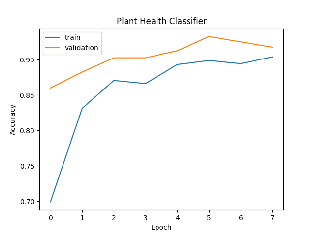

# 🌿 Plant Health Checker

A simple deep learning project that checks whether a **tea leaf** is **healthy or diseased** from a photo.

## How it works

- **Task:** binary image classification (healthy vs diseased)
- **Model:** MobileNetV2 (pretrained on ImageNet) with transfer learning
- **Data:** Tea Leaf Disease dataset from Kaggle (6 classes: healthy, algal_spot, brown_blight, gray_blight, helopeltis, red_spot)
  - All 5 disease classes are merged into one `diseased` class
  - Classes are balanced: 1,000 healthy and 1,000 diseased images
  - 80% training, 20% validation
- **Framework:** TensorFlow / Keras, run in Google Colab

## Results

- Validation accuracy: **XX%**
- Tested on real photos outside the dataset: (write a short note here)

## How to run

1. Download the dataset from Kaggle: https://www.kaggle.com/datasets/saikatdatta1994/tea-leaf-disease
2. Open `plant_health_colab.ipynb` in [Google Colab](https://colab.research.google.com) and choose a T4 GPU runtime (Runtime > Change runtime type).
3. Run the cells from top to bottom. Upload the dataset zip when asked.
4. In the last cell, upload a tea leaf photo to see if it is healthy or not.

## Project files

| File | Purpose |
|------|---------|
| `plant_health_colab.ipynb` | Complete notebook: prepare data, train, test |
| `plant_model.keras` | Trained model |
| `accuracy.png` | Training and validation accuracy graph |
| `requirements.txt` | Python libraries needed |

## Limitations

- The model is trained on **tea leaves only**, so it will not work reliably on other plants.
- Training images are close-up photos; images with a plain white background can give lower confidence.
- It only says healthy or not healthy. It does not name the specific disease.

## Possible improvements

- Multi-class classification to name the exact disease
- Train on more plant species (for example PlantVillage)
- Fine-tune the base model for higher accuracy

## Dataset credit

Tea Leaf Disease dataset by saikatdatta1994 on Kaggle. Please follow the dataset's license and terms.
